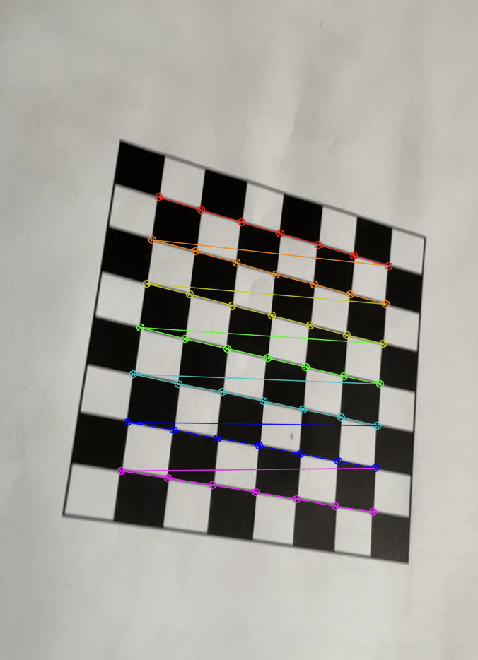
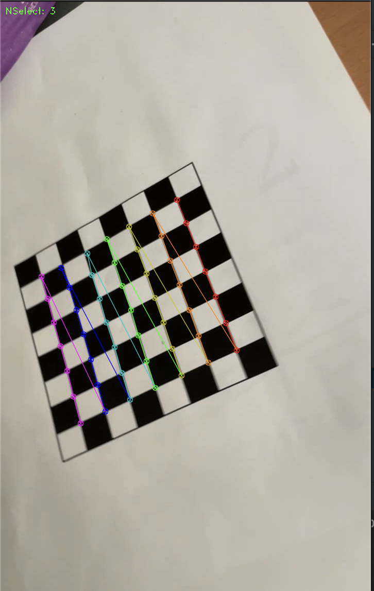
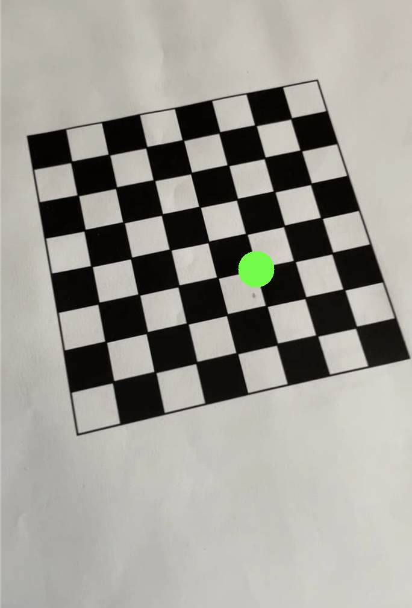

<h1> sphereOnChess</h1>
<pre>카메라 캘리브레이션과 AR. 
(8,8) , 1센치의 체스보드. 체스보드를 다른 각도로 촬영한 이미지들로부터 camera 내부,외부 파라미터들을 구하고 
구한 카메라 정보를 기반으로 pose estimation을 수행해서 AR로 원을 그려봤다. 레퍼지토리 제목은 구를 올리는 것이지만. . !
그냥 원을 올려봤다. 
</pre>
camera calibration with openCV 

<h1>Camera Calibration</h1>
**Camera Calibration Results**
* The number of selected images = 2  
* RMS error = 1.649112626792416  
* Camera matrix (K) =   
[[1.24527890e+03 0.00000000e+00 4.12889925e+02]  
 [0.00000000e+00 1.22044227e+03 6.12577803e+02]  
 [0.00000000e+00 0.00000000e+00 1.00000000e+00]]  
* Distortion coefficient (k1, k2, p1, p2, k3, ...) = [ 2.79954451e-01  6.94100229e+00  5.28079213e-04  2.33354297e-02
 -2.37393069e+02]
  
 
<h1>Pose estimation</h1>
